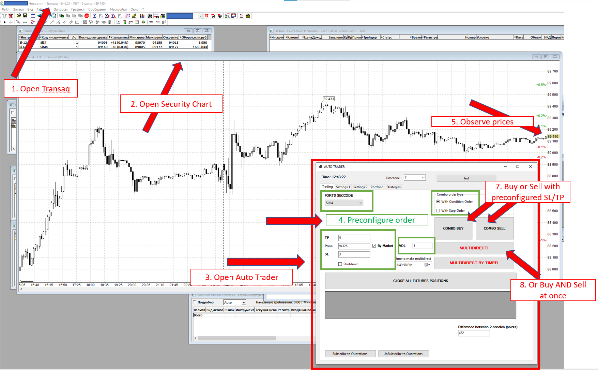
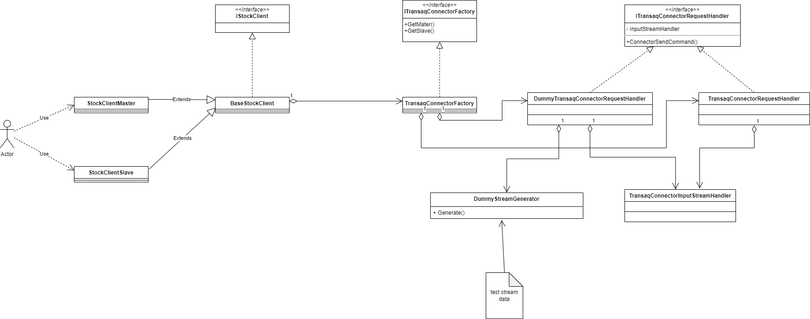
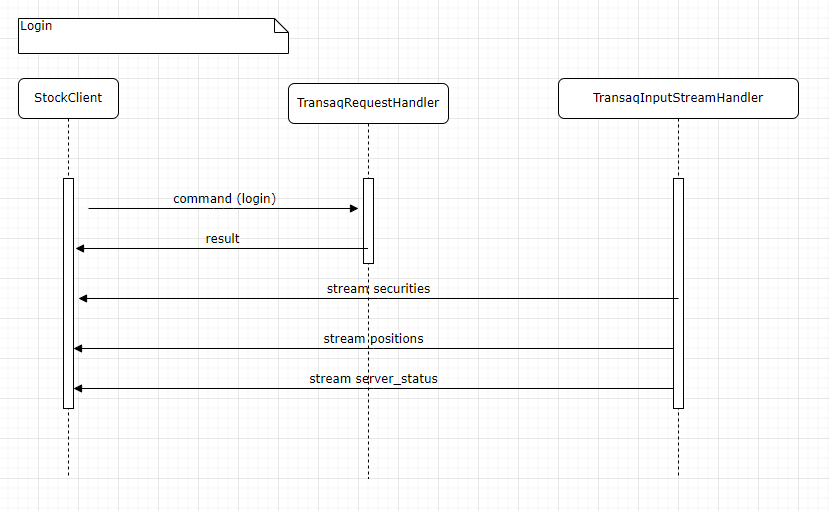
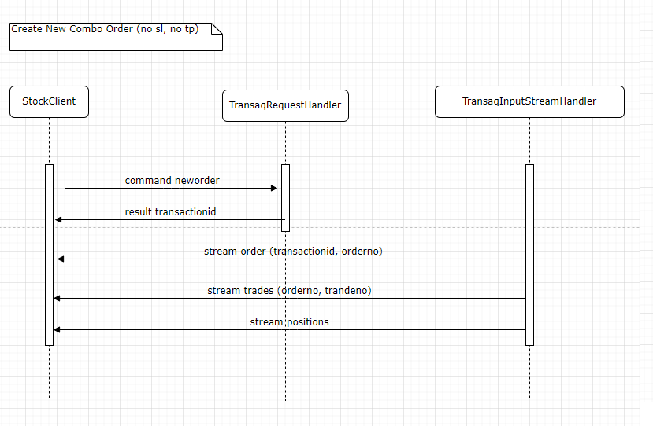

# About

This is application for trading on Moscow Stock Exchange via Finam broker.
Application uses Transaq connector.

# How does it work (Common workflow)

1. Open Transaq
2. Open Security Chart
3. Open AutoTrader
4. Preconfigure order on AutoTrader
5. Observe prices
7. Buy or Sell with preconfigured SL/TP by COMBO-ORDER
8. Or Buy AND Sell simultaneously by MULTIDIRECT ORDER

# Functions:
- Login / Logout
- Change password
- Create and send order by **one click** with specified Price / Stop Lose / Take Profit
- Create ComboOrder - combination of "openning" order as Market order that opens trade and closing order as Conditional/Stop order, that is closing trade in case of SP / TP
- Create MultiDirectional order - combination of 2 ComboOrders (1 order to buy, 1 order to sell) on 2 different accounts.
- Schedule MultiDirectional order with specified time
- View ClientId, FreeMoney
- Subscribe to quotations
* trading is only on futures stock

# Used Approaches / Technologies

- Clean Architecture
- Dependency Injection
- **IDisposable**
  - For disposing of unmanaged resources
  - **Path:** AutoTrader.Infrastructure.Stock.TransaqConnector.TransaqConnectorRequestHandler
- Unmanaged Resources
  - Using of C++ library
  - **Path:** AutoTrader.Infrastructure.Stock.TransaqConnector.TransaqConnectorRequestHandler
- MultiThreading
- Asynchronousness
- Unit Tests
- Mediatr
  - **Path:** AutoTrader.Application.Features
- Concurrency
  - **Path:** AutoTrader.Infrastructure.Stock.TransaqConnector.TransaqConnectorInputStreamHandler

# Stock Client Class Diagram

# Login Sequence Diagram

# Create Combo Order Sequence Diagram

